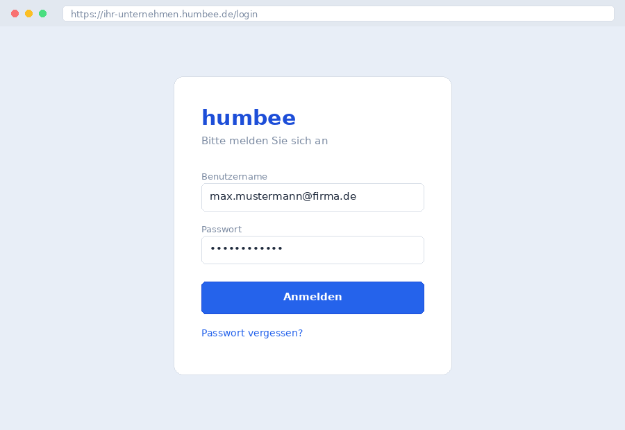

# An humbee anmelden

::: {.print-only}
Bevor Sie mit humbee arbeiten können, müssen Sie sich anmelden. Die Anmeldedaten
erhalten Sie von der Administration Ihres Unternehmens.
:::

## Voraussetzungen

Für die Anmeldung benötigen Sie einen Benutzernamen, ein Passwort und – sofern
die Zwei-Faktor-Authentifizierung aktiviert ist – ein Smartphone mit einer
Authenticator-App. humbee läuft in jedem aktuellen Browser; empfohlen werden
Microsoft Edge, Google Chrome und Mozilla Firefox in der jeweils aktuellen Version.

## Anmeldung durchführen

1. Rufen Sie die Adresse Ihrer humbee-Instanz auf, zum Beispiel `https://ihr-unternehmen.humbee.de`.
2. Geben Sie Ihren Benutzernamen ein. Der Benutzername ist in der Regel Ihre dienstliche E-Mail-Adresse.
3. Geben Sie Ihr Passwort ein und bestätigen Sie mit **Anmelden**.
4. Ist die Zwei-Faktor-Authentifizierung aktiv, geben Sie anschließend den sechsstelligen Code aus Ihrer Authenticator-App ein.

{width=75%}

Nach erfolgreicher Anmeldung öffnet sich die Startseite. Wie diese aufgebaut ist,
beschreibt der Abschnitt [Die Oberfläche kennenlernen](020-oberflaeche.md).

## Passwort vergessen

Klicken Sie in der Anmeldemaske auf **Passwort vergessen**. humbee sendet Ihnen
einen Link an die hinterlegte E-Mail-Adresse, über den Sie ein neues Passwort
vergeben können. Der Link ist 30 Minuten gültig und kann nur einmal verwendet werden.

Erhalten Sie keine E-Mail, prüfen Sie zunächst Ihren Spam-Ordner. Ist dort nichts
zu finden, wenden Sie sich an Ihre Administration – möglicherweise ist eine andere
E-Mail-Adresse hinterlegt oder Ihr Benutzerkonto ist deaktiviert.

## Abmelden

Klicken Sie oben rechts auf Ihr Benutzerkürzel und wählen Sie **Abmelden**. Aus
Sicherheitsgründen meldet humbee Sie nach 8 Stunden Inaktivität automatisch ab.
Nicht gespeicherte Eingaben gehen dabei verloren.
