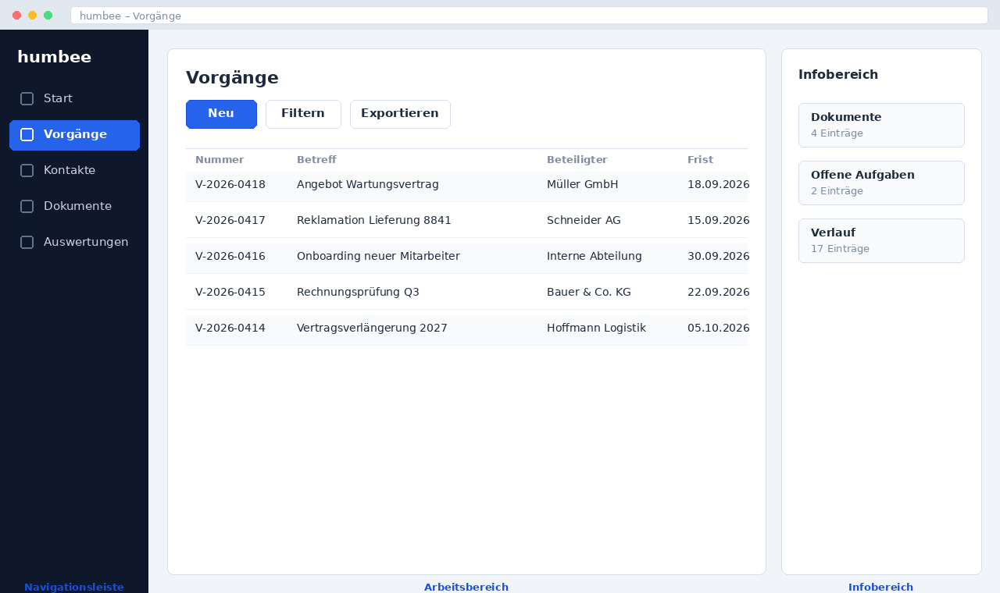

# Die Oberfläche kennenlernen

Die humbee-Oberfläche ist in drei Bereiche gegliedert, die auf jeder Seite
gleich bleiben. Wer diese drei Bereiche kennt, findet sich in jedem Modul zurecht.

{width=90%}

## Navigationsleiste

Die Navigationsleiste am linken Rand enthält die Hauptbereiche: **Start**,
**Vorgänge**, **Kontakte**, **Dokumente** und **Auswertungen**. Ein Klick auf das
Symbol öffnet den Bereich, ein Klick auf den Pfeil am oberen Rand blendet die
Beschriftungen ein oder aus.

## Arbeitsbereich

Im Arbeitsbereich in der Mitte findet die eigentliche Arbeit statt. Er zeigt je
nach Auswahl eine Liste, einen einzelnen Datensatz oder eine Auswertung. Über
der Liste stehen immer die Schaltflächen **Neu**, **Filtern** und **Exportieren**.

## Infobereich

Der Infobereich am rechten Rand zeigt Zusatzinformationen zum gerade geöffneten
Datensatz: zugeordnete Dokumente, offene Aufgaben und den Verlauf. Er lässt sich
über das Symbol in der rechten oberen Ecke ein- und ausblenden.

## Tastenkürzel

| Kürzel | Funktion |
|---|---|
| `Strg` + `K` | Globale Suche öffnen |
| `Strg` + `N` | Neuen Datensatz im aktuellen Bereich anlegen |
| `Strg` + `S` | Änderungen speichern |
| `Esc` | Dialog schließen ohne zu speichern |

::: {.wiki-only}
Die globale Suche über `Strg` + `K` durchsucht Vorgänge, Kontakte und
Dokumentinhalte gleichzeitig und ist der schnellste Weg zu einem bekannten Datensatz.
:::
