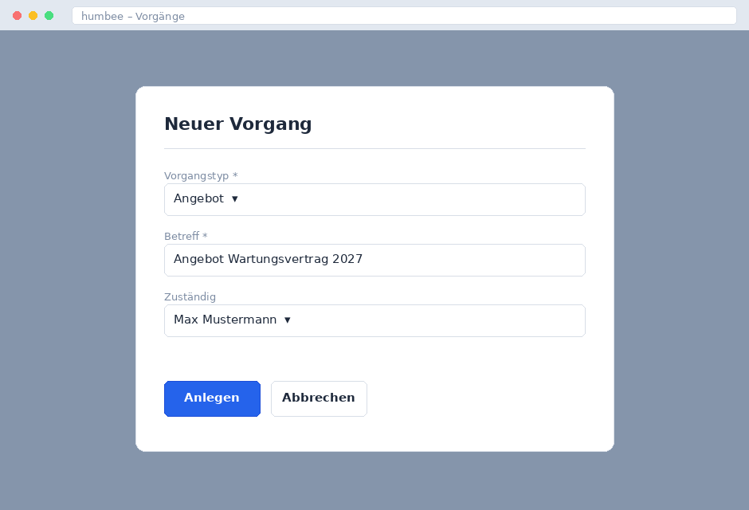

# Vorgang anlegen

Ein Vorgang bündelt alles, was zu einem Geschäftsfall gehört: Beteiligte,
Dokumente, Aufgaben und den gesamten Schriftverkehr. Jede Arbeit in humbee
beginnt daher mit einem Vorgang.

## Neuen Vorgang erstellen

1. Wechseln Sie in der Navigationsleiste in den Bereich **Vorgänge**.
2. Klicken Sie auf **Neu**. Alternativ drücken Sie `Strg` + `N`.
3. Wählen Sie im Dialog den passenden **Vorgangstyp** aus.
4. Vergeben Sie einen aussagekräftigen **Betreff**.
5. Bestätigen Sie mit **Anlegen**.

{width=70%}

humbee vergibt automatisch eine fortlaufende Vorgangsnummer. Diese Nummer ist
unveränderlich und dient als Referenz in der Kommunikation mit Kunden.

## Den Vorgangstyp richtig wählen

Der Vorgangstyp entscheidet darüber, welche Felder im Vorgang zur Verfügung
stehen, welche Aufgaben automatisch erzeugt werden und wer den Vorgang sehen
darf. Er lässt sich nachträglich nur von der Administration ändern – wählen Sie
ihn daher sorgfältig aus.

::: {.print-only}
Welche Vorgangstypen in Ihrem Unternehmen eingerichtet sind, entnehmen Sie der
Anlage „Vorgangstypen" am Ende dieses Handbuchs oder erfragen Sie bei Ihrer
Administration.
:::

## Kontakt zuordnen

Ordnen Sie jedem Vorgang den beteiligten Kontakt zu. Klicken Sie dazu im
Vorgang auf **Beteiligte → Hinzufügen** und suchen Sie den Kontakt über Namen,
Kundennummer oder E-Mail-Adresse. Ist der Kontakt noch nicht vorhanden, legen
Sie ihn direkt aus dem Suchdialog heraus über **Neuen Kontakt anlegen** an.

Ohne zugeordneten Kontakt lässt sich ein Vorgang zwar speichern, aber nicht
abschließen.

## Frist setzen

Tragen Sie im Feld **Frist** das Datum ein, bis zu dem der Vorgang bearbeitet
sein muss. humbee zeigt Vorgänge mit überschrittener Frist auf der Startseite
rot markiert an und erinnert die zuständige Person per E-Mail.

Wie Sie einen bestehenden Vorgang weiterbearbeiten, beschreibt der Abschnitt
[Vorgang bearbeiten](020-vorgang-bearbeiten.md).
