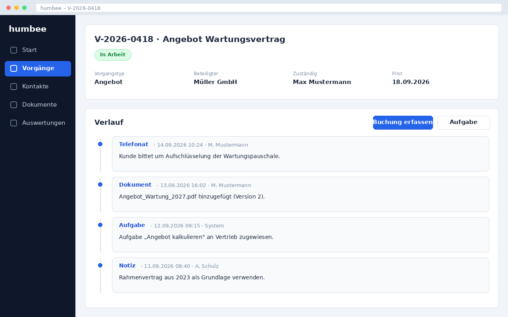

# Vorgang bearbeiten

Ein geöffneter Vorgang zeigt oben die Stammdaten und darunter den Verlauf. Der
Verlauf ist die Chronik des Vorgangs: Jede Buchung, jede Aufgabe und jedes
Dokument erscheint dort mit Zeitstempel und Verfasser.

{width=90%}

## Buchung erfassen

Eine Buchung hält fest, was im Vorgang passiert ist – ein Telefonat, eine
Entscheidung, eine Rückmeldung.

1. Klicken Sie im Verlauf auf **Buchung erfassen**.
2. Wählen Sie die Buchungsart, zum Beispiel *Telefonat* oder *Notiz*.
3. Erfassen Sie den Text und bestätigen Sie mit **Speichern**.

Buchungen lassen sich nach dem Speichern nicht mehr löschen. Eine fehlerhafte
Buchung korrigieren Sie, indem Sie eine neue Buchung mit der Richtigstellung
erfassen. So bleibt der Verlauf revisionssicher.

## Aufgabe erstellen und zuweisen

Über **Aufgabe erstellen** legen Sie eine To-do im Vorgang an und weisen sie
einer Person oder einer Gruppe zu. Die Aufgabe erscheint bei der zuständigen
Person unter **Meine Aufgaben** auf der Startseite.

Setzen Sie immer ein Planungsdatum. Aufgaben ohne Datum tauchen in keiner
Terminübersicht auf und werden erfahrungsgemäß übersehen.

## Vorgang abschließen

Ist die Arbeit erledigt, klicken Sie auf **Abschließen**. humbee prüft
dabei, ob noch offene Aufgaben existieren und ob ein Kontakt zugeordnet ist.
Sind beide Bedingungen erfüllt, wechselt der Vorgang in den Status
*Abgeschlossen* und verschwindet aus den Arbeitslisten.

Ein abgeschlossener Vorgang bleibt lesbar und durchsuchbar. Muss er wieder
bearbeitet werden, öffnen Sie ihn über **Wieder öffnen**; humbee vermerkt das
Wiederöffnen im Verlauf.
