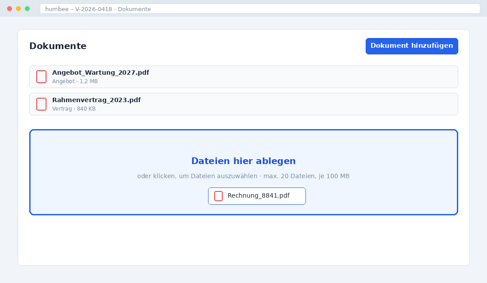

# Dokument hochladen

Dokumente werden in humbee immer an einem Vorgang oder einem Kontakt abgelegt,
nie freischwebend. Dadurch ist jederzeit nachvollziehbar, in welchem
Zusammenhang eine Datei entstanden ist.

## Datei hochladen

Öffnen Sie den Zielvorgang und ziehen Sie die Datei aus dem Explorer auf den
Bereich **Dokumente**. Alternativ klicken Sie auf **Dokument hinzufügen** und
wählen die Datei im Dialog aus.

{width=80%}

Pro Upload sind bis zu 20 Dateien mit je maximal 100 MB möglich. Größere
Dateien lehnt humbee mit einer Meldung ab.

## Dokumenttyp vergeben

Nach dem Upload fragt humbee den **Dokumenttyp** ab, zum Beispiel *Rechnung*,
*Vertrag* oder *Schriftverkehr*. Der Dokumenttyp steuert die Aufbewahrungsfrist
und die Sichtbarkeit. Lassen Sie das Feld nicht leer – ohne Typ landet das
Dokument in der Sammelablage und ist später schwer wiederzufinden.

## Neue Version ablegen

Liegt eine überarbeitete Fassung vor, laden Sie diese nicht als neues Dokument
hoch, sondern als neue Version des bestehenden: Öffnen Sie das Dokument und
wählen Sie **Neue Version**. humbee behält alle vorherigen Versionen und zeigt
sie im Reiter **Versionen** mit Datum und Bearbeiter an.

## Volltextsuche

humbee erkennt den Text in PDF-Dateien und Office-Dokumenten automatisch und
macht ihn durchsuchbar. Gescannte Dokumente werden per Texterkennung
aufbereitet; das kann nach dem Upload einige Minuten dauern.

Wie Sie Dokumente einem Vorgang zuordnen, der noch nicht existiert, beschreibt
der Abschnitt [Vorgang anlegen](../020-vorgaenge/010-vorgang-anlegen.md).
